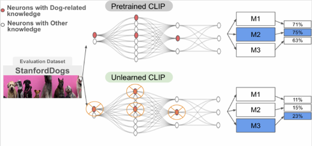

<div align="center">
  <h1>Rethinking Few Shot CLIP Benchmarks: A Critical Analysis in the Inductive Setting</h1>   
</div>

<br></br>

<p align="center">  </p> 

This repository contains the reference code for the paper *Rethinking Few Shot CLIP Benchmarks: A Critical Analysis in the Inductive Setting.*

[🎯 Project web page](https://akres001.github.io/Rethinking-Few-Shot-CLIP-Benchmarks-A-Critical-Analysis-in-the-Inductive-Setting/) |
[🤗 HuggingFace Unlearned CLIP Models](https://huggingface.co/MLAlex1/unlearned_clip/tree/main) |

## Table of Contents

1. [Citation](#citation)
2. [Overview](#overview)
3. [Datasets](#datasets)
4. [Models](#models)
5. [Usage](#usage)
6. [Test a New Few-shot Method](#newmethod)
7. [Reproduce Unlearned Models](#repunlearned)

## Citation <a name="citation"></a>

```
@InProceedings{kravets2025rethinkingfsl,
author    = {Kravets, Alexey and Chen, Da and P. Namboodiri, Vinay},
title     = {{Rethinking Few Shot CLIP Benchmarks: A Critical Analysis in the Inductive Setting}},
booktitle = {Proceedings of the IEEE/CVF International Conference on Computer Vision (ICCV)},
year      = {2025}
}
```

## Overview <a name="overview"></a>

CLIP is a foundational model with transferable classification performance in the few-shot setting. Several methods have shown improved performance of CLIP using few-shot examples. However, so far all these techniques have been benchmarked using standard few-shot datasets. We argue that this mode of evaluation does not provide a true indication of the inductive generalization ability using few-shot examples. As most datasets have been seen by the CLIP model, the resultant setting can be termed as partially transductive. To solve this, we propose a pipeline that uses an unlearning technique to obtain true inductive baselines. In this new inductive setting, methods show a significant drop in performance (-55%) on average among 13 baselines with multiple datasets). We validate the unlearning technique using oracle baselines. An improved few-shot classification technique is proposed that consistently obtains state-of-the-art performance over 13 other recent baseline methods on a comprehensive analysis with 5880 experiments - varying the datasets, differing number of few-shot examples, unlearning setting, and with different seeds. Thus, we identify the issue with the evaluation of CLIP-based few-shot classification, provide a solution using unlearning, propose new benchmarks, and provide an improved method. 


## Datasets <a name="datasets"></a>

To download the datasets follow `DATASETS.md` guidelines. 

## Models <a name="models"></a>

The checkpoints used in various experiments are hosted on Huggingface platform. Download the checkpoints as below and unzip into `/models_checkpoints` folder. 

```bash
wget https://huggingface.co/MLAlex1/unlearned_clip/models_checkpoints.zip
unzip models_checkpoints.zip
```

## Usage <a name="usage"></a>

To run few-shot methods use the following script:

```
python3 FSL/run_process_parallel.py --attempt 1 --models 'all' --datasets 'stanford_dogs,stanford_cars,oxford_flowers,caltech101,fgvc_aircraft,ucf101,cub,' --source_model 'test_models'
```

This will start building the results in `./few_shot_out/results_1` folder running all the few-shot learning methods. At the end of the run it will create a `.pkl` file that you can read to see the results. \
If you want to run only certain methods use `--models 'coop,cocoop,'`

Similarly, for the results using CLIP trained from scratch with a held-out dataset run:

```
python3 FSL/run_process_parallel.py --attempt 2 --models 'all' --datasets 'dogs_imagenet,birds_imagenet,vehicles_imagenet,' --source_model 'scratch_nocls'
```

For the results using CLIP trained from scratch and unlearning a dataset run:

```
python3 FSL/run_process_parallel.py --attempt 3 --models 'all' --datasets 'dogs_imagenet,birds_imagenet,vehicles_imagenet,' --source_model 'scratch_unlearned'
```


## Test a New Few-shot Method <a name="newmethod"></a>

If you want to test your own method:

1. Add it to the `/FSL/trainers` folder.
2. Add the `import` statement with your method in `/FSL/trainers/train.py`. 
3. Create a `.sh` file in `/FLS` similar to others. 
4. Run one of the commands in `Usage` section to test your method with the unlearned CLIP models.


## Reproduce Unlearned Models <a name="repunlearned"></a>

To reproduce the unlearned models follow the instruction in the `unlearning_clip.ipynb` notebook. 

